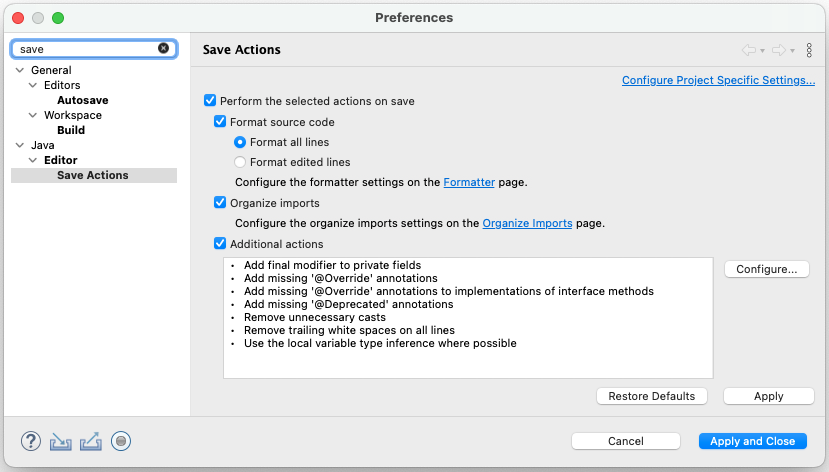
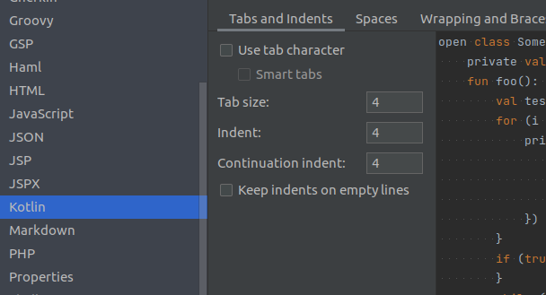
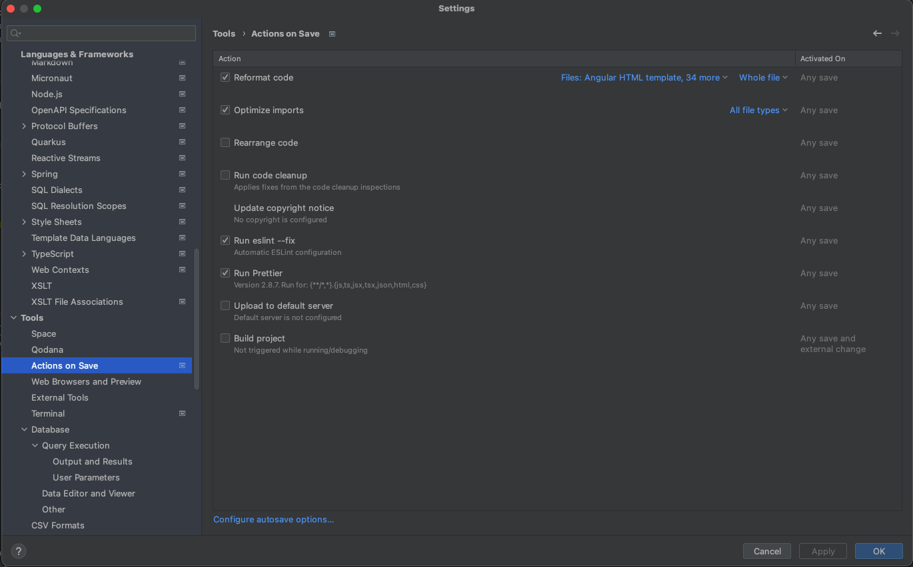

# Developer Toolset for Sonar-* Projects

Toolset for the developers contributing to http://github.com/SonarSource and http://github.com/SonarCommunity repositories.

## SonarLint

[Dogfooding](https://en.wikipedia.org/wiki/Eating_your_own_dog_food) is a core principle at SonarSource. Installing [SonarLint](http://sonarlint.org/) in your favorite IDE is strongly recommended. Any feedback should be provided on:
* for SonarSourcer: the [category Dogfooding>SonarLint of the internal forum](https://discuss.sonarsource.com/c/dogfood/sl) and/or the Slack channels:\
  SonarLint for Eclipse: [#squad-ide-eclipse](https://sonarsource.slack.com/archives/C03QE05EX26)\
  SonarLint for IntelliJ: [#squad-ide-intellij-family](https://sonarsource.slack.com/archives/C03QDTTJ5JP)\
  SonarLint for Visual Studio: [#squad-ide-visualstudio](https://sonarsource.slack.com/archives/C03PE8P8TK6)\
  SonarLint for Visual Studio Code: [#squad-ide-vscode](https://sonarsource.slack.com/archives/C03M0AJ3BKR)
* for community: the [SonarSource forum](https://community.sonarsource.com/), using the tag `sonarlint`.

The "connected mode" feature should also be enabled and configured with https://next.sonarqube.com/ or https://sonarcloud.io, depending on projects.

Eclipse users should also rely on the dogfooding Eclipse Update Site in order to experiment latest milestones:
* Help → Install New Software ...
* Add a repository pointing to https://binaries.sonarsource.com/SonarLint-for-Eclipse/dogfood/
* Initially install the plug-in, to check for updates: Help → Check for Updates

Intellij users should also rely on the development marketplace in order to experiment latest milestones:
* Open Settings → Plugins → Manage plugins repositories
* Add a custom plugin repository pointing to https://repox.jfrog.io/repox/sonarsource-public-builds/org/sonarsource/sonarlint/intellij/sonarlint-intellij/updatePlugins.xml

## Git

If you have never used Git before, you need to do some setup first. Run the following commands so that Git knows your name and email.

    git config --global user.name "Your Name"
    git config --global user.email "your@email.com"

Setup line endings preferences:

    # For Unix/Mac users
    git config --global core.autocrlf input
    git config --global core.safecrlf true

    # For Windows users
    git config --global core.autocrlf true
    git config --global core.safecrlf true

On Windows, you must explicitly tell Git to use long paths so you won't run into issues with files in deeply nested directories:

    git config --global core.longpaths true

The merge is working pretty well on small repositories (with move and rename of files). But it's not working on large repositories as the detection of file renaming is O(n²), so we need to update some threshold (more explanations are available in this post : http://blogs.atlassian.com/2011/10/confluence_git_rename_merge_oh_my/) :

    git config --global merge.renameLimit 10000

#### Commit messages

Commits must relate to a JIRA issue. Convention for messages inspired by http://tbaggery.com/2008/04/19/a-note-about-git-commit-messages.html :

* The first line should be short (72 chars or less) and auto-descriptive in a format "<JIRA KEY> <DESCRIPTION>", for example "SONAR-1937 Code review"
* Write your commit message in present imperative tense: "Fix bug" and not "Fixed bug".
* The second line is blank.
* Next lines optionally define a short summary of changes (wrap them to about 72 chars or so).

Example :

    SONAR-2204,SONAR-2259 Fix URL encoding

    * For correct URL encoding we must encode parameters on lower level -
    in Query itself, but not in concrete implementation of Connector,
    because in Query we can distinguish concrete parts of URL.

    * Moreover in this case any additional encoding routines in Connector
    are useless, so were removed.

If the change concerns a documentation-only change, then prefix it with "DOC ".

## GitHub Configuration

The following points must be respected in the GitHub account settings:
* If using your personal Github Account, the sonarsource email address must be set as primary
* Uncheck "Keep my email addresses private"
* The same name must be used in the Github profile and in the local git config key user.name

## Eclipse Configuration

Eclipse settings are available in the directory [/eclipse](/eclipse).

### Imports

[sonar-formatter.xml](/eclipse/sonar-formatter.xml):
positions new lines, comments, spaces, parentheses, etc. To be imported in Window > Preferences > Java > Code Style > Formatter.

[sonar.importorder](/eclipse/sonar.importorder):
organizes the "import" lines. To be imported in Window > Preferences > Java > Code Style > Organize Imports.

[sonar-cleanup.xml](/eclipse/sonar-cleanup.xml):
cleans up the code, by organizing imports, formating source code, correcting indentation, etc.
To be imported in Window > Preferences > Java > Code Style > Clean Up.

In Windows > Preferences > Java > Editor > Save Actions, check the checkboxes to perform the clean
up at every "save" action. The "additional actions" displayed should be configured as well.

### Additional Configuration

In Window > Preferences > Maven > Errors/Warnings, set "Plugin execution not covered by lifecycle execution" to "Ignore". This will silence out error messages when importing your Maven projects

On Windows, in Window > Preferences > General > Workspace, set "Text file encoding" to "UTF-8" and "New text file line delimiter" to "Unix".

## Code Style Configuration for Intellij

### Eclipse Code Formatter
Intellij IDEA users must install the plugin [Adapter for Eclipse Code Formatter](http://plugins.jetbrains.com/plugin/?id=6546):
* Check `Use the Eclipse code formatter`
* Set `Eclipse workspace/project folder or config file` to [sonar-formatter.xml](/eclipse/sonar-formatter.xml)
* Check `Optimize Imports (IntelliJ's Import Optimizing must be turned ON)`
* Set `Import Order from file` to [sonar.importorder](/eclipse/sonar.importorder)

### General Editor
Go to `Preferences/Settings > Editor > General`:
* Check `Ensure every saved file ends with a line break` (under the `On Save` section).

Go to `Preferences/Settings > Editor > General > Auto import`:
* Check `Optimize imports on the fly` for Java:

### Automatic IntelliJ Code Style
You can either import the code style settings to IntelliJ IDEA by simply importing [this scheme](intellij/codestyle_sonar_developer_toolset.xml) in IDEA's code style settings (`Editor > 'Code Style' > Java > 'Scheme' > ⚙️  > 'Import Scheme' > 'IntelliJ IDEA code style XML'`),
or you can apply the settings manually (see below). The result should be the same.

### Manual Java Code Style
Follow these steps to set code style settings if not using [this scheme](intellij/codestyle_sonar_developer_toolset.xml) from above.

Go to `Preferences/Settings > Editor > Code Style > Java > Tabs and Indents`:
* Set `Tab size` to 2
* Set `Indent` to 2
* Set `Continuation indent` to 2

Go to `Preferences/Settings > Editor > Code Style > Java > Wrapping and Braces > Method declaration parameter`:
* Uncheck `Align when multiline`

Go to `Preferences/Settings > Editor > Code Style > Java > JavaDoc > Other`:
* Uncheck `Generate "
" on empty lines`

Go to `Preferences/Settings > Editor > Code Style > Java > Imports`
* Set `Class count to use import with '*'` to 999
* Set `Names count to use static import with '*'` to 999
* Remove both lines from `Packages to Use Import with '*'`
* Set `Import Layout` to:
  * `import all other imports`
  * `<blank line>`
  * `import static all other imports`
  * `import module imports`

### Manual Kotlin Code Style
Go to `Preferences/Settings > Editor > Code Style > Kotlin > Tabs and Indents`:
* Set `Tab size` to 4
* Set `Indent` to 4
* Set `Continuation indent` to 4

Go to `Preferences/Settings > Editor > Code Style > Kotlin > Imports`:
* Select `Use single name import` in `Top-Level Symbols`
* Select `Use single name import` in `Java Statics and Enum Members`
* Remove all entries from the list `Packages to Use Imports with '*'`

Go to `Preferences/Settings > Editor > Code Style > Kotlin > Other`:
* Check `Use trailing comma`
  

For Kotlin, we use the default 140 character line length.

### Manual XML Code Style

Go to `Preferences/Settings > Editor > Code Style > XML > Tabs and Indents`:
* Set `Tab size` to 2
* Set `Indent` to 2
* Set `Continuation indent` to 2

Go to `Preferences/Settings > Editor > Code Style > XML > Other`:
* Set `Hard wrap at` to 140
* Check `Keep line breaks in text`
* Check `Keep white spaces`

### Manual Groovy Code Style

In order to correctly format build.gradle files, code style for Groovy has to be set.

Go to `Preferences/Settings > Editor > Code Style > Groovy`:
* Set `Tab size` to 2
* Set `Indent` to 2
* Set `Continuation indent` to 2

### Manual JavaScript/TypeScript Code Style
For Javascript (Typescript)
Go to `Preferences/Settings > Editor > Code Style > TypeScript > Imports`:
* Check `Sort imported members`
* Check `Sort imports by modules`

We use a tool called **Prettier**. In order to ensure it functions correctly, install the [Prettier plugin](https://www.jetbrains.com/help/idea/prettier.html).
Once installed set the files as such:

The Prettier plugin requires IntelliJ Ultimate, but it's possible to use it without the plugin, e.g. [like this](https://github.com/SonarSource/sonar-developer-toolset/pull/32#issuecomment-1514574604).

Then to make sure prettier is run correctly, modify the on save actions:

### Manual Scala Code Style
Install [Scala plugin](https://plugins.jetbrains.com/plugin/1347-scala) if not installed already

Go to `Preferences/Settings > Editor > Code Style > Scala > Imports`:
* Set `Class count to use import with '_'` to 999
* Check `Merge imports with the same prefix into one statement`
* Ensure to have the following `Import Layout` (it should be the default):

## (Optional) Build Configuration for Intellij

If the project uses maven, and you experience problems with the built-in build system (*Build* ➡️ *Rebuild Project*) like long build times or build failures, you should [delegate the build to maven](https://www.jetbrains.com/help/idea/delegate-build-and-run-actions-to-maven.html#delegate_to_maven). Make sure to skip tests during the build:

