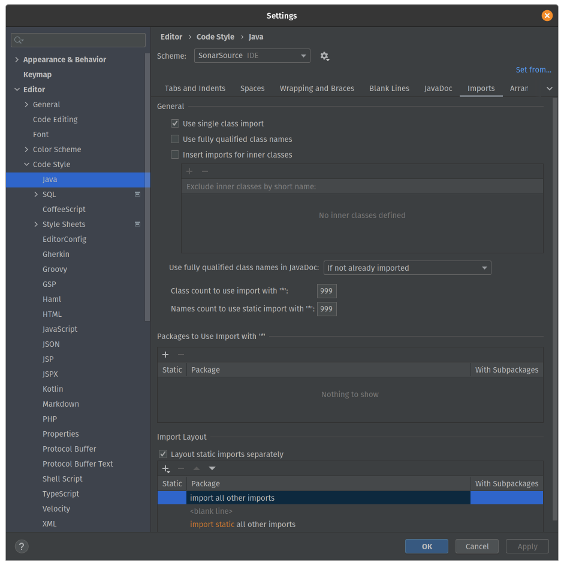

# Developer Toolset for Sonar-* Projects

Toolset for the developers contributing to http://github.com/SonarSource and http://github.com/SonarCommunity repositories.

## SonarLint

[Dogfooding](https://en.wikipedia.org/wiki/Eating_your_own_dog_food) is a core principle at SonarSource. Installing [SonarLint](http://sonarlint.org/) in your favorite IDE is strongly recommended. Any feedback should be provided on:
* for SonarSourcer: the [category Dogfooding>SonarLint of the internal forum](https://discuss.sonarsource.com/c/dogfood/sl) and/or the Slack channel #sonarlint. 
* for community: the [SonarSource forum](https://community.sonarsource.com/), using the tag `sonarlint`.

The "connected mode" feature should also be enabled and configured with https://next.sonarqube.com/ or https://sonarcloud.io, depending on projects.

Intellij users should also rely on the development marketplace in order to experiment latest milestones:
* Open Settings → Plugins → Manage plugins repositories
* Add a custom plugin repository pointing to https://repox.jfrog.io/repox/sonarsource-public-builds/org/sonarsource/sonarlint/intellij/sonarlint-intellij/updatePlugins.xml

## Git

If you have never used Git before, you need to do some setup first. Run the following commands so that Git knows your name and email.

    git config --global user.name "Your Name"
    git config --global user.email "your@email.com"

Setup line endings preferences:

    # For Unix/Mac users
    git config --global core.autocrlf input
    git config --global core.safecrlf true

    # For Windows users
    git config --global core.autocrlf true
    git config --global core.safecrlf true

The merge is working pretty well on small repositories (with move and rename of files). But it's not working on large repositories as the detection of file renaming is O(n²), so we need to update some threshold (more explanations are available in this post : http://blogs.atlassian.com/2011/10/confluence_git_rename_merge_oh_my/) :

    git config --global merge.renameLimit 10000

#### Commit messages

Commits must relate to a JIRA issue. Convention for messages inspired by http://tbaggery.com/2008/04/19/a-note-about-git-commit-messages.html :

* The first line should be short (72 chars or less) and auto-descriptive in a format "<JIRA KEY> <DESCRIPTION>", for example "SONAR-1937 Code review"
* Write your commit message in present imperative tense: "Fix bug" and not "Fixed bug".
* The second line is blank.
* Next lines optionally define a short summary of changes (wrap them to about 72 chars or so).

Example :

    SONAR-2204,SONAR-2259 Fix URL encoding

    * For correct URL encoding we must encode parameters on lower level -
    in Query itself, but not in concrete implementation of Connector,
    because in Query we can distinguish concrete parts of URL.

    * Moreover in this case any additional encoding routines in Connector
    are useless, so were removed.

If the change concerns a documentation-only change, then prefix it with "DOC ".

## Eclipse Configuration

Eclipse settings are available in the directory [/eclipse](/eclipse).

### Imports

[sonar-formatter.xml](/eclipse/sonar-formatter.xml):
positions new lines, comments, spaces, parentheses, etc. To be imported in Window > Preferences > Java > Code Style > Formatter.

[sonar.importorder](/eclipse/sonar.importorder):
organizes the "import" lines. To be imported in Window > Preferences > Java > Code Style > Organize Imports.

[sonar-cleanup.xml](/eclipse/sonar-cleanup.xml):
cleans up the code, by organizing imports, formating source code, correcting indentation, etc.
To be imported in Window > Preferences > Java > Code Style > Clean Up. If additionally you want to perform clean up at every "save" action, check the checkboxes in Window > Preferences > Java > Editor > Save Actions.

[junit-templates.xml](/eclipse/junit-templates.xml) (optional):
defines shortcuts "temp" and "thrown" in the unit tests. To be imported in Window > Preferences > Java > Editor > Template.

### Additional Configuration

In Window > Preferences > Maven > Errors/Warnings, set "Plugin execution not covered by lifecycle execution" to "Ignore". This will silence out error messages when importing your Maven projects

On Windows, in Window > Preferences > General > Workspace, set "Text file encoding" to "UTF-8" and "New text file line delimiter" to "Unix".

In order to use the Maven Eclipse integration, you should download the os-maven-plugin and install it as an eclipse plugin (for example by putting it into your eclipse/plugins folder). The download link and installation steps are descriped in [the os-maven-plugin readme](https://github.com/trustin/os-maven-plugin/blob/master/README.md#user-content-issues-with-eclipse-m2e-or-other-ides).

## Code Style Configuration for Intellij

Intellij IDEA users must install the plugin [Adapter for Eclipse Code Formatter](http://plugins.jetbrains.com/plugin/?id=6546) and import Eclipse settings files:
* check the "Use the Eclipse code formatter" option and use [sonar-formatter.xml](/eclipse/sonar-formatter.xml) as the Eclipse Java Formatter config file
* check the "From file" option in the "Import order" section and use [sonar.importorder](/eclipse/sonar.importorder)

You can either import the code style settings to IntelliJ IDEA by simply importing [this scheme](intellij/codestyle_sonar_developer_toolset.xml)
in IDEA's code style settings (`Editor > 'Code Style' > Java > 'Scheme:' > ⚙️  > 'Import Scheme' > 'IntelliJ IDEA code style XML'`), or you can apply the settings manually (see below). The result should be the same.

Go to `Preferences/Settings > Editor > General` and check the option `Ensure every saved file ends with a line break` (under the `On Save` section).

Go to `Preferences/Settings > Editor > Code Style > Java > Wrapping and Braces > Method declaration parameter` and uncheck `Align when multiline`

Go to `Preferences/Settings > Editor > Code Style > Java > Tabs and Indents` and update:
* `Tab size: 2`
* `Indent: 2`
* `Continuation indent: 2`

Go to `Preferences/Settings > Editor > Code Style > Java > JavaDoc > Other` and uncheck `Generate "
" on empty lines`

Go to `Preferences/Settings > Editor > Code Style > Kotlin > Tabs and Indents` and update:
* `Continuation indent: 4`

Go to `Preferences/Settings > Editor > Code Style > Kotlin > Imports` and update:
* Check `Use single name import` in `Top-Level Symbols`
* Check `Use single name import` in `Java Statics and Enum Members`
* Remove all entries from the list `Packages to Use Imports with '*'`

Go to `Preferences/Settings > Editor > Code Style > Kotlin > Other` and update:
* Check `Use trailing comma`
  

For Kotlin, we use the default 140 character line length.

Go to `Preferences/Settings > Editor > Code Style > XML > Tabs and Indents` and update:
* `Tab size: 2`
* `Indent: 2`
* `Continuation indent: 2`

Then go to `Preferences/Settings > Editor > Code Style > XML > Other` and set/check:
* `Hard wrap at 140`
* `Keep line breaks in text`
* `Keep white spaces`

In order to correctly format build.gradle files, code style for Groovy has to be set.

Then go to `Preferences/Settings > Editor > Code Style > Groovy` and set/check:
* `Tab size: 2`
* `Indent: 2`
* `Continuation indent: 2`

IDEA must also be manually configured for imports : `Preferences/Settings > Editor > Code Style > Java > Imports`
* Class count to use import with '*'" -> 999
* Names count to use static import with '*' -> 999
* Remove both lines from `Packages to Use Import with '*'`
* Import Layout
  * import all other imports
  * &lt;blank line&gt;
  * import static all other imports
    

Then go to `Preferences/Settings > Editor > General > Auto import` and check "Optimize imports on the fly" for Java:

## (Optional) Build Configuration for Intellij

If the project uses maven and you experience problems with the built-in build system (*Build* ➡️ *Rebuild Project*) like long build times or build failures, you should [delegate the build to maven](https://www.jetbrains.com/help/idea/delegate-build-and-run-actions-to-maven.html#delegate_to_maven). Make sure to skip tests during the build:

